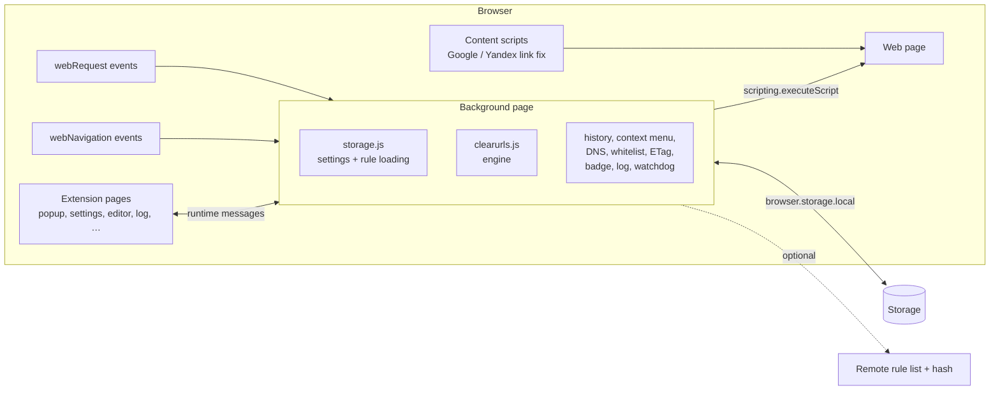
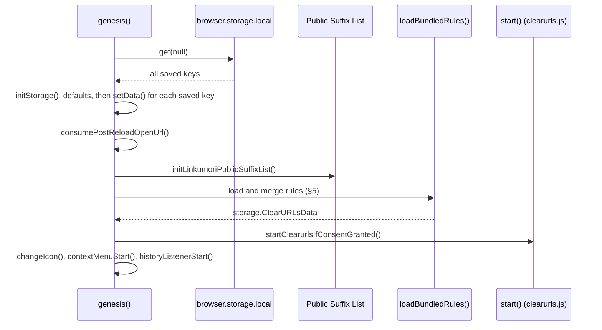
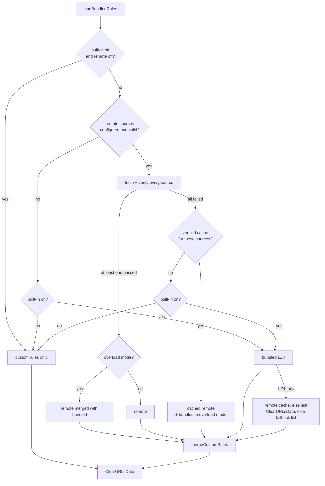
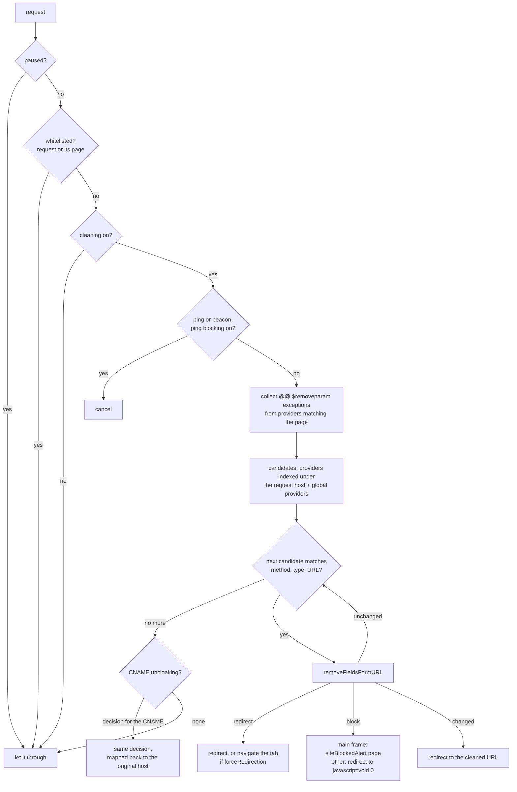

# Linkumori runtime architecture

How Linkumori works inside the browser: what runs where, how rules are
loaded, and what happens to a request. It is written for people changing
the code. The rule format itself is in [filter-syntax.md](filter-syntax.md);
building and linting rules are in [CONTRIBUTING.md](../CONTRIBUTING.md).

File and function names are given so you can jump to the code. Line numbers
are not, because they move.

## 1. Overview

Linkumori is a Manifest V3 Firefox extension (desktop 140+, Android 142+).
It has three kinds of runtime code:

| Part | Where it runs | What it does |
|---|---|---|
| Background page | one event page, 23 classic scripts ([manifest.json](../manifest.json) `background.scripts`) | loads rules, holds settings, cleans requests with blocking `webRequest`, answers the pages |
| Extension pages | `html/*.html` with their `core_js/*.js` script | popup, settings, custom rules editor, log, tools; they talk to the background by messages |
| Content scripts | registered at runtime, only while *search link fix* is on | Google and Yandex result-link fixes |

There is no server. The only network requests Linkumori makes on its own are
for remote rule lists, and only when the user configures them (§5.2).



## 2. The background page

All background scripts are classic scripts in one global scope. They call
each other's functions directly (`pureCleaning()`, `getData()`,
`isWhitelisted()`, …), so **load order matters**: a script may only call
another script's functions at *runtime*, never while loading, unless that
script is listed earlier.

| Order | Script | Role |
|---|---|---|
| 1 | `external_js/linkumori-i18n.js` | `LinkumoriI18n`: replacement for `browser.i18n` that loads `_locales/<lang>/messages.json` itself |
| 2 | `core_js/message_handler.js` | `runtime.onMessage` bridge for the pages (§10) |
| 3 | `external_js/IP-Ranger.js` | IP address parsing and classification |
| 4 | `external_js/sha256.js` | SHA-256 |
| 5 | `core_js/tools.js` | shared helpers: `translate`, URL helpers, counters, icon, log (`pushToLog`), keep-alive |
| 6–7 | `external_js/light-punycode.js`, `external_js/publicsuffixlist.js` | punycode; Public Suffix List parser (`linkumoriPsl`) |
| 8 | `core_js/badgedHandler.js` | per-tab badge counter |
| 9 | `core_js/pureCleaning.js` | cleaning outside `webRequest`, and the rule test lab (§7.1) |
| 10 | `core_js/context_menu.js` | *Copy clean link* context menu |
| 11 | `core_js/historyListener.js` | cleans URLs changed with the History API (§7.2) |
| 12 | `external_js/regex_analyzer.js` | regex analysis |
| 13 | `core_js/linkumori_rule_ids.js` | `LinkumoriRuleIds`: generated rule ids, shared with the editor and CLI (§6.2) |
| 14 | `clearurls.js` | the engine: providers, request cleaning, `start()` (§6) |
| 15 | `core_js/linkumori_dns.js` | `LinkumoriDNS`: CNAME uncloaking (§6.5) |
| 16 | `core_js/whitelist.js` | whitelists and the temporary tab whitelist (§8) |
| 17 | `external_js/linkumori_lz4_block.js` | `LinkumoriLZ4`: decompresses the bundled rules |
| 18 | `core_js/storage.js` | settings, persistence, rule loading; calls `genesis()` last (§3–§5) |
| 19 | `core_js/content_script_manager.js` | registers the search link fix content scripts (§7.3) |
| 20 | `core_js/watchdog.js` | self-test every minute (§9) |
| 21 | `core_js/eTagFilter.js` | ETag header filtering (§7.4) |
| 22 | `external_js/decode-uri-component.js` | lenient URI decoding for redirect targets |
| 23 | `core_js/consent_config.js` | current policy and POSAR versions for the consent gate |

`consent_config.js` loads last, but `genesis()` reads its values only after
an asynchronous storage read, so they are defined by then.

### Main globals

| Global | Defined in | Holds |
|---|---|---|
| `storage` | storage.js | in-memory copy of every setting and of the loaded rules (§4) |
| `providers`, `providersByToken`, `globalProviders` | clearurls.js | the compiled providers and the lookup index (§6.3) |
| `requestContextManager` | clearurls.js | URLs of each tab and frame, for context checks (§6.6) |
| `clearurlsProviderSnapshot` | clearurls.js | every active and disabled rule with its ids, read by the editor's *Disabled rules* page |
| `badges` | badgedHandler.js | per-tab badge counts |
| `temporaryTabWhitelist` | whitelist.js | per-tab domains allowed for this tab only |

### Keeping the page alive

Firefox can suspend an MV3 background event page when it is idle. `tools.js`
calls `browser.runtime.getPlatformInfo` every 20 seconds (`keepAlive`) so
the page, its in-memory `storage` and its compiled providers stay loaded.

## 3. Startup

`storage.js` calls `genesis()` once all background scripts have loaded:



If rule loading fails, the same last four steps still run.

### Consent gate

Cleaning only starts once the user has accepted the current privacy policy,
the current POSAR version and the adult confirmation:

- `consent_config.js` sets `Linkumoriversion` and `LinkumoriPOSARversion`.
- `hasPopupConsentForStartup()` compares them with the accepted versions in
  storage (`popupConsentPolicyVersionAccepted`,
  `popupConsentPOSARVersionAccepted`, `popupConsentAdultAccepted`).
- Until they match, `start()` is not called, so there are no providers and
  no `webRequest` listener. The ETag filter and History API cleaning are
  registered at load time, so they check `isCleaningStarted()` and do
  nothing before then. The context menu is also created, but with no
  providers it copies links unchanged.
- Accepting in the popup or on `legal.html` writes those keys. A
  `storage.onChanged` listener in storage.js sees them and starts cleaning
  without a restart.
- When the policy version is raised, earlier consent no longer counts:
  cleaning does not start, and `legal.html` opens.

On first install, storage.js opens `html/legal.html?source=first_install`.

### `start()`

`start()` in clearurls.js:

1. starts Public Suffix List support (`initPslSupport`) and
   `requestContextManager`;
2. calls `tryInitialize()`, which builds the providers from
   `storage.ClearURLsData` and registers the `webRequest` listener. If no
   rules are loaded yet, it retries every 200 ms, up to 50 times, then
   registers the listener anyway;
3. calls `setBadgedStatus()`.

It also defines `globalThis.updateProviderData()`, which rebuilds the
providers from `storage.ClearURLsData` without a restart (§5.5).

## 4. Settings and persistence

`storage` is an in-memory object holding every setting. It is the source of
truth while the extension runs; `browser.storage.local` is its saved copy.

- **Defaults:** `initSettings()` sets every default. Remote rules, logging,
  ETag filtering, redirect bypass and the search link fix start **off**.
  Built-in rules, CNAME uncloaking, domain blocking, ping blocking, the
  History API listener and the context menu start **on**.
- **Loading and writing:** `setData(key, value)` normalises each key as it
  loads or changes: JSON strings are parsed, booleans coerced, remote URLs
  validated. It also migrates renamed keys (`globalurlcounter` becomes
  `totalCounter`) and drops obsolete ones.
- **Saving:** `saveOnDisk(keys)` writes keys now. `deferSaveOnDisk(key)`
  queues a key and writes the queue one minute later (the
  `deferSaveOnDisk` alarm); counters and the log use this, because they
  change on every request. `saveOnExit()` writes everything.
- **Changes made elsewhere:** some modules also listen to
  `storage.onChanged`, for keys that pages write straight to
  `browser.storage.local`:
  - `globalStatus` and the theme update the toolbar icon;
  - `contextMenuEnabled` rebuilds the context menu;
  - `searchLinkFixEnabled` registers or removes the content scripts;
  - the consent keys start cleaning (§3).

Keys that shape the runtime:

| Key | Meaning |
|---|---|
| `ClearURLsData` | the merged rules the engine runs (§5) |
| `custom_rules` | the user's custom providers, as saved by the editor |
| `customrules_import_exclusions` | providers the user switched off (by provider signature) |
| `clearurls_disabled_rule_ids` | rules the user switched off, as `<scope>::<ruleId>` (§6.2) |
| `userWhitelist`, `historyApiWhitelist` | whitelists (§8) |
| `builtInRulesEnabled`, `remoteRulesEnabled`, `overloadModeEnabled` | which rule sources to use (§5) |
| `ruleURL` + `hashURL`, `remoteRuleSets` | remote rule sources |
| `remoteRulescache`, `remoteRulesHealth` | last verified remote rules; fetch history |
| `hashStatus`, `hashValidationStatus`, `dataHash`, `mergeStats`, `rulesMetadata` | what was loaded, from where, and how it merged; shown in settings |
| `globalStatus`, `temporaryPauseUntil` | cleaning on/off; pause end time |
| `types`, `pingRequestTypes` | request types the `webRequest` listener receives |
| `redirectionEnabled`, `domainBlocking`, `pingBlocking`, `referralMarketing`, `localHostsSkipping`, `eTagFiltering`, `linkumoriCNAMEUncloakEnabled`, … | feature switches |
| `totalCounter`, `cleanedCounter`, `log`, `logLimit`, `loggingStatus` | statistics and the log (§9) |

## 5. Rule loading

`loadBundledRules()` in storage.js decides which rule sources to use,
merges them with the custom rules, and stores the result in
`storage.ClearURLsData`.

### 5.1 Sources

| Source | Where it comes from |
|---|---|
| Bundled | `data/linkumori-clearurls-min.json.lz4`, built by `node linkumori-cli-tool.js clearurls` from `data/linkumori-clearurls.json` and decompressed with `LinkumoriLZ4` |
| Remote | one or more `ruleURL` + `hashURL` pairs set by the user (§5.2) |
| Remote cache | `remoteRulescache`: the last remote rules that passed verification |
| Custom | `custom_rules`, from the custom rules editor |
| Fallback | a small built-in list in `getEnhancedFallbackRules()`, used when nothing else loads |

### 5.2 Remote rules

Remote rules are off by default. Each source is a pair of URLs, and both
must be valid (`areValidRemoteURLsPresent()`, `isValidRuleURL()`).

1. Fetch the hash URL: 32–128 hex characters (`fetchRemoteHash`).
2. Fetch the rule URL, and check that the SHA-256 of the raw text matches
   (`fetchRemoteRules`, `verifyRulesHash`). A mismatch rejects the source.
3. Parse it as Linkumori JSON with a `providers` object.

Both requests use `cache: 'no-store'`, so the rules and their hash always
come from the same moment. Sources are fetched in parallel. The ones that
pass are merged (`mergeRemoteRulesSources`): providers with the same
pattern and settings become one provider (`getProviderGroupKey`,
`mergeRemoteProviderGroup`). The result is saved as `remoteRulescache`.

The outcome of every attempt is recorded in `remoteRulesHealth`, which
settings shows.

### 5.3 Choosing the sources



`hashStatus` records which path was taken, for example `bundled_rules_loaded`,
`remote_verified`, `remote_rules_partially_merged`,
`cache_remote_rules_after_remote_failure` or `fallback_rules_used`. When custom
rules are merged in, it gets a `custom` variant, such as `custom_rules_merged`.

### 5.4 Merging custom rules

`mergeCustomRules(baseRules)` builds the final list:

1. Providers the user switched off (`customrules_import_exclusions`) are
   removed from both the base rules and the custom rules.
2. Providers without `urlPattern` or `domainPatterns` are dropped.
3. A custom provider **replaces** a base provider with the same group key
   (the same pattern, `methods`, `resourceTypes`, `completeProvider` and
   `forceRedirection`). Their rules are not combined.
4. Other custom providers are added. A name already in use gets `_1`, `_2`, ….
5. Every provider goes through `attachProviderActivationIds()`: each rule
   gets its activation ids (`_linkumoriActivationIds`) and, if its id
   changed, its old ids (`_linkumoriLegacyRuleIds`); see §6.2.
6. The result is saved as `ClearURLsData`, with `dataHash` (SHA-256 of a
   key-sorted serialisation) and `mergeStats`.

### 5.5 When rules reload

Rules are loaded at startup, and again only when:

- the custom rules editor saves, or settings asks for a refresh
  (`reloadCustomRules()` / `refreshRemoteRulesNow()`). These call
  `updateProviderData()`, so the new rules apply without a restart;
- the extension restarts (`reload()`, used by some settings and by the
  watchdog).

Nothing refreshes remote rules on a timer.

## 6. The engine (clearurls.js)

### 6.1 Providers

`createProviders()` turns every provider in `ClearURLsData` into a
`Provider` object:

- its match pattern (`domainPatterns`, or `urlPattern` plus `indexPattern`);
- its compiled rule lists: field rules, raw rules, referral-marketing rules,
  `$removeparam` filters and their `@@` exceptions, exceptions, redirections,
  field redirections;
- its `methods` and `resourceTypes`.

Rules that fail to compile, or use an option the engine does not accept,
are skipped. The custom rules editor and `lint-rules` report such rules
before they are saved.

### 6.2 Rule ids and switched-off rules

Every rule has an id: its own `id`, or one generated by `LinkumoriRuleIds`
from its list and text (see
[filter-syntax.md: Rule ids](filter-syntax.md#rule-ids)). The engine,
storage.js, the custom rules editor and the CLI all use
`core_js/linkumori_rule_ids.js`, so they always produce the same ids.

A rule can be switched off in two ways; both are stored in
`clearurls_disabled_rule_ids`:

| Scope | Stored as | Switches the rule off |
|---|---|---|
| Provider | `<provider>::<ruleId>` | everywhere in that provider |
| Pattern | `domainPattern:<pattern>::<ruleId>` or `urlPattern:<pattern>::<ruleId>` | only for URLs that match that one pattern |

While providers are built, `attachCoreRuleIdentity()` gives each rule its
ids, and `filterCoreRuleActivationIds()` drops the switched-off ones.

A setting saved under an old id also counts, and is then moved to the
current id (`migrateCoreRuleAliasActivationIds`). Old ids come from two
places:

- the rule's `aliases` (after a rename);
- its legacy ids, which it gets after its generated id changed.

The result is published as `clearurlsProviderSnapshot` (via `getData`),
which the editor's *Disabled rules* page lists.

### 6.3 Finding the providers for a URL

Checking every provider against every URL would be slow, so the engine
indexes providers by hostname token:

- **Providers.** Each provider registers in `providersByToken` under the
  main label of each of its `domainPatterns`. A `urlPattern` provider uses
  its `indexPattern` instead. The main label is the one just before the
  public suffix: `||amazon.*^` and `||smile.amazon.co.uk^` both register
  under `amazon` (`getLookupTokens`).
- **Requests.** `getHostnameLookupTokens(host)` returns every label of the
  request host, so `www.amazon.co.uk` looks up `www`, `amazon`, `co` and
  `uk`, and finds the `amazon` providers.
- **Global providers.** Some providers are in `globalProviders` and are
  checked against **every** URL:
  - a `urlPattern` provider without `indexPattern` (which is why
    `lint-rules` warns about it);
  - a provider with a `/regex/` domain pattern.

### 6.4 Cleaning a request

The `webRequest.onBeforeRequest` listener (blocking) covers `<all_urls>`
and the request types in `types` + `pingRequestTypes`. It records tab and
frame URLs for `requestContextManager`, skips `data:` URLs, and calls
`clearUrl(request)`:



The first provider that redirects, blocks or changes the URL decides the
result. A redirect is a new request, so the cleaned URL goes through
`clearUrl()` again.

A provider's `exceptions` are checked while matching the URL
(`matchRequestURL`), so an excepted URL never reaches the next step.
`removeFieldsFormURL(provider, url, …)` then applies the provider in the
order described in
[filter-syntax.md §1](filter-syntax.md#how-a-url-is-processed):

1. It skips local hosts (`localHostsSkipping`).
2. `redirections` and `fieldRedirections` apply (only while redirection is on).
3. `completeProvider` blocks the request (only while domain blocking is on).
4. The ordered cleaning steps run (`getOrderedCleaningSteps()`): raw rules
   on the URL text; field rules and referral-marketing rules on query and
   fragment parameters. Parameters already handled by a `$removeparam`
   filter are left to that filter.
5. `$removeparam` filters run, minus their `@@` exceptions and the
   exceptions collected from the page's providers.

It logs each change and updates the badge unless called in quiet mode.

### 6.5 CNAME uncloaking

If no provider made a decision, and CNAME uncloaking is on,
`LinkumoriDNS.replayCNAMEIfNeeded()` (linkumori_dns.js) checks whether the
request host is an alias:

- It asks `browser.dns.resolve(host, ['canonical_name'])`. Answers are
  cached for 10 minutes, up to 512 hosts.
- It skips page loads (`main_frame`), non-HTTP(S) URLs, IP addresses,
  proxied requests, and (by default, `cnameIgnoreRootDocument`) requests to
  the page's own host.
- A CNAME within the same registrable domain (`a.example.com` →
  `b.example.com`) counts as no CNAME.
- It runs `clearUrl()` again on the URL with the canonical host. Unless
  `cnameReplayFullURL` is on, that URL keeps only the host and drops the
  path and query.
- If that produces a block or a redirect, the decision is returned with the
  original hostname put back.

### 6.6 Request context

Some decisions depend on the page a request comes from:

- `@@` exceptions, which also cover requests made by a page the provider
  matches;
- `domain=`, `first-party` and `third-party` options;
- whitelists, which also cover subresources of a whitelisted page.

`requestContextManager.collectContextURLs(request)` returns every URL that
can stand for that page:

- the request's `documentUrl`, `originUrl`, `initiator` and `referrer`;
- the tab's URL, kept up to date from `tabs.onUpdated` and
  `webNavigation.onCommitted`;
- the URLs of the frame's ancestor frames.

### 6.7 Public Suffix List

`initPslSupport()` loads `data/public_suffix_list.dat` into `linkumoriPsl`.
The engine uses it for:

- hostname tokens (§6.3);
- `||example.*^` patterns, which match any public suffix;
- `first-party` and `third-party`, which compare registrable domains.

If it fails to load, hostname tokens fall back to plain labels, `.*`
patterns (in rules and in the whitelist) stop matching, and
`first-party` / `third-party` compare full hostnames instead of
registrable domains.

## 7. Other cleaning paths

### 7.1 `pureCleaning(url)`

`pureCleaning()` (pureCleaning.js) cleans a URL outside `webRequest`. It
runs every provider over the URL until it stops changing. It does not use
the token index, and there is no request, so options that depend on the
request (party, type, method) do not apply. It is used by:

- the *Copy clean link* context menu, which injects `clipboard-helper.js`
  and copies the result (context_menu.js);
- History API cleaning (§7.2);
- the Cleaning tool page, over messaging;
- the watchdog (§9).

`runRuleTestLab()` and `pureCleaningTrace()` use the same loop, but record
which provider and rule changed what. The custom rules editor's test lab
shows this trace. `traceClearURLWebRequestTest()` does the same through the
real `clearUrl()` for the regression page.

### 7.2 History API

`webNavigation.onHistoryStateUpdated` (historyListener.js) fires when a
page changes its own URL with `pushState` or `replaceState`. The listener:

1. does nothing before cleaning has started (§3), and skips the URL if it
   is paused or whitelisted, including the History API whitelist and the
   temporary tab whitelist;
2. cleans it with `pureCleaning(url, false, true)`, where rules with
   `historyBypassProtection: false` do not run;
3. if the URL changed, runs `history.replaceState(null, "", cleanUrl)` in
   the frame with `scripting.executeScript`.

### 7.3 Search link fix (content scripts)

`content_script_manager.js` registers two content scripts with
`scripting.registerContentScripts`, and only while `searchLinkFixEnabled`
is on (default off). They run at `document_end` in all frames:

- `google_link_fix.js` on Google search domains stops Google from
  rewriting result links into tracking redirects;
- `yandex_link_fix.js` does the same on Yandex.

The registration is refreshed on install, on browser start, and when the
setting changes.

### 7.4 ETag filtering

`eTagFilter.js` registers a blocking `webRequest.onHeadersReceived`
listener with `responseHeaders`. While `eTagFiltering` is on (default off),
it replaces the value of each `ETag` response header with a random value of
the same form, so the ETag cannot be used as a tracking id. It does nothing
before cleaning has started (§3), and skips local hosts, whitelisted
requests, and paused cleaning.

## 8. Whitelists and pausing

| Mechanism | Stored in | Skips |
|---|---|---|
| Whitelist | `userWhitelist` | all cleaning for matching hosts, and for requests made by pages on them |
| History API whitelist | `historyApiWhitelist` | only History API cleaning (§7.2) |
| Temporary tab whitelist | memory only (`temporaryTabWhitelist`), per tab | cleaning for those hosts in that tab until it closes |
| Pause | `temporaryPauseUntil` (time), or memory only until restart | all cleaning, until the time passes or the browser restarts |

Whitelist entries are hostname patterns (`example.com` also covers its
subdomains) or IP addresses (`matchWhitelistHostnamePattern`). The popup
adds and removes entries over messaging.

## 9. Counters, badge, log and watchdog

- **Counters:** `increaseTotalCounter` counts parameters seen and
  `increaseCleanedCounter` counts cleanings, while statistics are on. Both
  are saved with `deferSaveOnDisk`.
- **Badge:** `increaseBadged(request)` (badgedHandler.js) counts cleanings
  per tab and shows the number on the toolbar button. The count resets when
  the tab's URL changes. Whitelisted requests never count.
- **Log:** while logging is on, `pushToLog()` (tools.js) appends an entry to
  `storage.log.log`:
  - the entry holds the URL before and after, the rule, the provider and
    pattern, the request type and method, the tab, and any CNAME;
  - the log keeps at most `logLimit` entries (default 100, never more than
    5000), dropping the oldest;
  - it is saved one minute later (`deferSaveOnDisk`);
  - each entry also goes straight to every open log page, over a
    `runtime.connect` port named `linkumori-logger`.
- **Watchdog:** every minute (alarm `watchdog`), watchdog.js cleans
  `https://linkumori.com?utm_source=addon` and checks that the result has no
  `utm_source`. It only runs while cleaning is on, consent is given, nothing
  is paused and a rule source is enabled. On failure it increases
  `watchDogErrorCount` and reloads the extension, at most twice in a row. A
  success resets the count.

## 10. Messaging between the pages and the background

Pages call the background with:

```js
browser.runtime.sendMessage({ function: 'getData', params: ['globalStatus'] })
```

`handleMessage()` (message_handler.js) always answers with a promise of
`{ response, error? }`.

| `function` | What it does |
|---|---|
| `getData` / `setData` | read or write one key of `storage`. For `custom_rules`, `clearurls_disabled_rule_ids`, `userWhitelist`, `historyApiWhitelist` and `ClearURLsData`, `setData` answers only after the key is saved to disk, so a restart that follows cannot lose it |
| `reloadCustomRules`, `mergeCustomRules`, `getCustomRulesStats`, `getBundledRulesOnly`, `getExistingLinkumoriDataForImport` | rule loading and statistics for the settings page and the editor |
| any other name | called on the background's global scope, but only if it is in the allowlist in `handleRegularFunction()` |

The allowlist covers:

- whitelist changes (`addToWhitelist`, `addToTemporaryTabWhitelist`,
  `removeFrom…`);
- pausing (`pauseCleaningTemporarily`, `pauseCleaningUntilRestart`,
  `resumeCleaningNow`, `getTemporaryPauseState`);
- rule information (`getRuleSourceInfo`, `getMergeStatistics`,
  `getRemoteRulesHealth`, `refreshRemoteRulesNow`);
- cleaning and tests (`pureCleaning`, `runRuleTestLab`,
  `traceClearURLWebRequestTest`, `applyRegressionRuleData`);
- maintenance (`storageAsJSON`, `saveOnExit`, `initSettings`, `reload`,
  `start`, `changeIcon`, `setBadgedStatus`).

**To add a background function a page can call:** define it in a background
script, then add its name to the allowlist.

Pages also read and write some keys directly with `browser.storage.local`:
the popup's consent keys, and settings that background listeners watch (§4).

## 11. Extension pages

| Page | Script | Purpose | Main background calls |
|---|---|---|---|
| `popup.html` | popup.js | toolbar popup: on/off, counters, pause, whitelist this site, consent gate | `getData`, `setData`, temporary whitelist, pause functions |
| `settings.html` (options page) | settings.js | all settings, rule sources, remote rules, export/import, statistics | `getData`, `setData`, `getRuleSourceInfo`, `getMergeStatistics`, `getRemoteRulesHealth`, `refreshRemoteRulesNow`, `storageAsJSON`, `reload` |
| `customrules.html` | custom_rules_editor.js | custom providers, rule on/off, import, test lab | `getData`, `setData`, `reloadCustomRules`, `getBundledRulesOnly`, `runRuleTestLab` |
| `log.html` | log.js | the cleaning log, live | `getData`, `setData`, port `linkumori-logger` |
| `cleaningTool.html` | cleaning_tool.js | clean pasted URLs | `pureCleaning` |
| `siteBlockedAlert.html` | siteBlockedAlert.js | shown when a provider blocks a page (`completeProvider`); links to the blocked address so it can still be opened | — |
| `legal.html` | about.js | privacy policy and consent | `setData`, `saveOnExit`, `reload` |
| `report.html` | report.js | prepares a GitHub issue about a broken page | — |
| `audit.html` | audit.js | shows the bundled, merged, custom and cached remote rules | `getData` |
| `regression.html` | regression_page.js | runs `tests/regression-suite.json` inside the extension | `applyRegressionRuleData`, `traceClearURLWebRequestTest`, `runRuleTestLab`, `storageAsJSON`, `start` |
| `guide.html` | guide.js | user guide | — |

Every page loads `theme_bootstrap.js` (themes), `linkumori-i18n.js` (text),
`accessibility_tools.js` (accessibility options) and usually
`write_version.js` (version footer).

## 12. Code shared between the background, pages and CLI

Some logic has to agree between the background, the custom rules editor
(which does not load the background scripts) and `linkumori-cli-tool.js`
(Node):

| Logic | Where it lives |
|---|---|
| Generated rule ids | one shared module, `core_js/linkumori_rule_ids.js`, loaded by the background and the editor and imported by the CLI |
| Rule validation (keys, options, `rawrule=`, `targetId`, …) | written twice: in the editor (`assert…` and `rawRuleOptionProblem` in custom_rules_editor.js) and in the CLI linter (`lintClearURLsRules`). Change both together |
| Pattern matching and option parsing | the engine (clearurls.js); the CLI smoke tests use a simplified copy |

## 13. Build time and runtime

| Build time (CLI) | Runtime (extension) |
|---|---|
| `data/linkumori-clearurls.json` is edited by hand | never read |
| `node linkumori-cli-tool.js clearurls` builds `data/linkumori-clearurls-min.json.lz4` with metadata | loaded at startup (§5.1) |
| `lint-rules`, `show-rule` check and inspect rules | the editor runs the same checks on save |
| `data/public_suffix_list.dat` is refreshed by the CLI | loaded by `linkumoriPsl` (§6.7) |
| `tests/regression-suite.json` is maintained in the repo | run by `regression.html` |

## 14. Things to know

Facts that matter when changing the code:

- **Remote rules have no timer.** They are fetched at startup and on a manual
  refresh (§5.5).
- **Listeners registered at load time must check consent.** Code that
  listens to browser events outside `start()` runs whether or not consent is
  given. Check `isCleaningStarted()` first, as the ETag filter and the
  History API listener do.
- **Any extension page can read or write any key.** `getData` and `setData`
  over messaging accept every key; other function calls are limited to the
  allowlist (§10). Web pages cannot send these messages.
- **The first provider wins.** For each request, the first provider that
  changes, redirects or blocks it decides the result. Provider order comes
  from the merged `ClearURLsData`.
